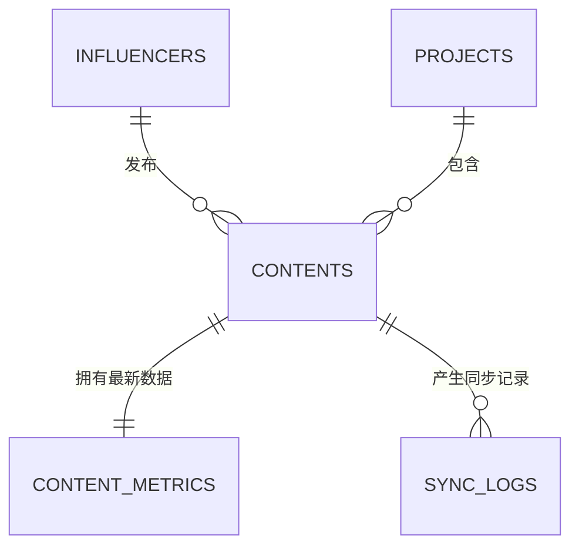
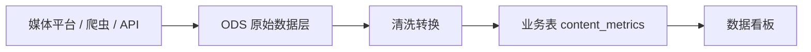

# 达人内容运营平台数据库设计 V1.0

## 1. 这份文档解决什么问题

这份文档说明第一版平台的数据应该如何保存、如何关联、如何避免重复，以及为后续“自动爬取/媒体 API 获取数据”预留什么结构。

你可以先把数据库理解成“更严谨的在线表格”：

- 表：类似在线表格里的一个 sheet，例如“达人表”“内容表”。
- 行：一条记录，例如一个达人、一条内容。
- 列：字段，例如达人名称、媒体平台、内容链接、播放量。
- 主键 id：系统内部给每条记录生成的唯一编号，类似每行的身份证。
- 外键：用来把两张表关联起来，例如内容表里的 `influencer_id` 指向达人表里的某个达人。
- 唯一约束：用来防止重复录入，例如“达人 + 媒体平台”不能重复。

第一版我们先做业务数据库，不做复杂数仓。后续如果要接爬虫、媒体 API、看板分析，可以再扩展 ODS 层。

## 2. 第一版核心数据对象

第一版有 4 个核心表：

| 表名 | 中文名 | 作用 |
| --- | --- | --- |
| `influencers` | 达人表 | 保存达人基础信息，一个达人在一个媒体平台上是一条记录 |
| `projects` | 项目表 | 保存合作项目，内容可以选择关联项目 |
| `contents` | 内容表 | 保存已经发布的内容，一条内容必须关联一个达人 |
| `content_metrics` | 内容数据表 | 保存内容最新数据，例如播放、点赞、评论、收藏、转发 |

另外预留 1 个同步日志表：

| 表名 | 中文名 | 作用 |
| --- | --- | --- |
| `sync_logs` | 数据同步日志表 | 记录每次爬虫/API 同步是否成功、失败原因 |

## 3. 表关系

用业务语言解释：

- 一个达人可以有多条内容。
- 一条内容只能属于一个达人。
- 一个项目可以有多条内容。
- 一条内容可以不关联项目，也可以关联一个项目。
- 一条内容有一份最新数据。
- 一条内容未来可能被爬虫/API 同步很多次，所以会有多条同步日志。

## 4. 表结构设计

### 4.1 达人表：`influencers`

用于保存达人基础信息。

| 字段名 | 中文含义 | 是否必填 | 说明 |
| --- | --- | --- | --- |
| `id` | 达人 ID | 是 | 系统自动生成 |
| `name` | 达人名称 | 是 | 例如达人昵称 |
| `platform` | 媒体平台 | 是 | 例如抖音、小红书、B站、视频号 |
| `account_id` | 平台账号 ID | 否 | 如果能拿到，建议填写 |
| `profile_url` | 主页链接 | 否 | 达人主页地址 |
| `category` | 达人分类 | 否 | 例如美妆、母婴、游戏、科技 |
| `followers_count` | 最新粉丝数 | 否 | 只保存当前最新值，不做历史记录 |
| `wechat` | 微信 | 否 | 联系方式之一 |
| `phone` | 手机号 | 否 | 联系方式之一 |
| `email` | 邮箱 | 否 | 联系方式之一 |
| `other_contact` | 其他联系方式 | 否 | 例如机构联系人、备注联系方式 |
| `owner` | 负责人 | 否 | 公司内部运营/商务负责人 |
| `status` | 状态 | 是 | 建议：正常、停用 |
| `remark` | 备注 | 否 | 补充说明 |
| `created_at` | 创建时间 | 是 | 系统自动记录 |
| `updated_at` | 更新时间 | 是 | 系统自动记录 |

关键规则：

- `name + platform` 必须唯一。
- 这对应你确认过的规则：同一个达人在两个媒体平台上，可以是两条达人记录。
- 不建议直接删除达人。如果不再合作，可以改成“停用”，这样历史内容不会断掉。

### 4.2 项目表：`projects`

用于保存合作项目。项目不是内容录入的必填项，但作为独立库存在。

| 字段名 | 中文含义 | 是否必填 | 说明 |
| --- | --- | --- | --- |
| `id` | 项目 ID | 是 | 系统自动生成 |
| `name` | 项目名称 | 是 | 例如某次推广活动、品牌合作项目 |
| `project_code` | 项目编号 | 否 | 可用于内部管理，填写时建议唯一 |
| `status` | 项目状态 | 是 | 建议：进行中、已结束、归档 |
| `owner` | 负责人 | 否 | 项目负责人 |
| `start_date` | 开始日期 | 否 | 项目周期开始 |
| `end_date` | 结束日期 | 否 | 项目周期结束 |
| `description` | 项目说明 | 否 | 项目背景、投放目标等 |
| `created_at` | 创建时间 | 是 | 系统自动记录 |
| `updated_at` | 更新时间 | 是 | 系统自动记录 |

关键规则：

- 内容录入时可以选择项目，也可以不选。
- 项目结束后不建议删除，应该改为“已结束”或“归档”。

### 4.3 内容表：`contents`

用于保存已经发布的内容。因为你确认“内容必须发布后才能录入”，所以内容链接是必填项。

| 字段名 | 中文含义 | 是否必填 | 说明 |
| --- | --- | --- | --- |
| `id` | 内容 ID | 是 | 系统自动生成 |
| `title` | 内容标题 | 是 | 可用内容标题或运营自定义标题 |
| `influencer_id` | 达人 ID | 是 | 关联达人表 |
| `project_id` | 项目 ID | 否 | 关联项目表，可为空 |
| `platform` | 媒体平台 | 是 | 通常从达人平台自动带出，便于筛选和统计 |
| `content_url` | 内容链接 | 是 | 发布后的内容链接 |
| `published_at` | 发布时间 | 是 | 内容实际发布时间 |
| `content_type` | 内容类型 | 否 | 例如视频、图文、直播切片 |
| `owner` | 负责人 | 否 | 内容运营负责人 |
| `status` | 内容状态 | 是 | 建议：正常、作废 |
| `remark` | 备注 | 否 | 补充说明 |
| `created_at` | 创建时间 | 是 | 系统自动记录 |
| `updated_at` | 更新时间 | 是 | 系统自动记录 |

关键规则：

- `content_url` 必须唯一。
- 一条内容链接只能对应一个达人。
- 脚本、demo 视频、审核流程暂时不进入第一版表结构。
- `platform` 虽然可以从达人表查到，但建议在内容表也保存一份，方便后续按平台筛选、统计、同步。

### 4.4 内容数据表：`content_metrics`

用于保存内容的最新表现数据。

| 字段名 | 中文含义 | 是否必填 | 说明 |
| --- | --- | --- | --- |
| `id` | 数据 ID | 是 | 系统自动生成 |
| `content_id` | 内容 ID | 是 | 关联内容表 |
| `view_count` | 播放量 | 否 | 视频播放/阅读量 |
| `like_count` | 点赞数 | 否 | 内容点赞数 |
| `comment_count` | 评论数 | 否 | 内容评论数 |
| `collect_count` | 收藏数 | 否 | 内容收藏数 |
| `share_count` | 转发数 | 否 | 内容转发/分享数 |
| `data_source` | 数据来源 | 是 | 建议：手动、爬虫、媒体 API |
| `sync_status` | 同步状态 | 是 | 建议：待同步、同步中、同步成功、同步失败、暂不支持 |
| `last_sync_at` | 最近同步时间 | 否 | 最近一次自动获取数据的时间 |
| `next_sync_at` | 下次同步时间 | 否 | 后续做定时同步时使用 |
| `failed_reason` | 失败原因 | 否 | 同步失败时记录 |
| `updated_at` | 更新时间 | 是 | 系统自动记录 |

关键规则：

- 一条内容只有一条“最新数据”记录。
- 互动量不建议单独存，优先由点赞 + 评论 + 收藏 + 转发实时计算，避免数据不一致。
- 第一版可以手动录入/修改数据。
- 后续爬虫/API 接入后，可以自动更新这些字段。

### 4.5 数据同步日志表：`sync_logs`

用于记录每一次自动爬取或 API 同步的结果。

| 字段名 | 中文含义 | 是否必填 | 说明 |
| --- | --- | --- | --- |
| `id` | 日志 ID | 是 | 系统自动生成 |
| `content_id` | 内容 ID | 是 | 关联内容表 |
| `source` | 同步来源 | 是 | 例如爬虫、抖音 API、小红书 API |
| `status` | 同步结果 | 是 | 成功、失败 |
| `started_at` | 开始时间 | 是 | 同步任务开始时间 |
| `finished_at` | 结束时间 | 否 | 同步任务结束时间 |
| `raw_summary` | 原始摘要 | 否 | 记录拿到的关键原始信息，不保存大段无用内容 |
| `error_message` | 错误信息 | 否 | 失败时记录原因 |

关键规则：

- 这个表不是正式 ODS，只是同步过程日志。
- 它能帮助我们知道：哪条内容同步失败了、为什么失败、什么时候失败。

## 5. 唯一性与防重复规则

第一版最重要的防重复规则有两个：

| 规则 | 目的 |
| --- | --- |
| `influencers.name + influencers.platform` 唯一 | 防止同一个平台重复录入同一个达人 |
| `contents.content_url` 唯一 | 防止同一条内容链接重复录入 |

可选增强规则：

| 规则 | 说明 |
| --- | --- |
| `influencers.platform + influencers.account_id` 唯一 | 如果能稳定拿到平台账号 ID，可以进一步防重 |
| `projects.project_code` 唯一 | 如果公司内部有项目编号，可以避免项目重复 |

## 6. 常用查询场景

数据库设计要服务业务使用。第一版常见查询包括：

| 使用场景 | 需要的数据 |
| --- | --- |
| 查某个达人发过哪些内容 | 达人表 + 内容表 |
| 查某个项目下有哪些内容 | 项目表 + 内容表 |
| 查某个平台内容表现 | 内容表 + 内容数据表 |
| 查最近发布内容的数据 | 内容表 + 内容数据表 |
| 查哪些内容同步失败 | 内容数据表 + 同步日志表 |
| 查播放量/点赞量最高的内容 | 内容表 + 内容数据表 |

## 7. 数据录入流程

### 7.1 新增达人

1. 运营/商务填写达人名称、媒体平台、粉丝数、联系方式等。
2. 系统检查“达人名称 + 媒体平台”是否已存在。
3. 如果不存在，保存达人。
4. 如果已存在，提示用户查看已有达人，避免重复录入。

### 7.2 新增项目

1. 运营/商务填写项目名称、负责人、项目周期等。
2. 系统保存项目。
3. 后续录入内容时，可以选择关联这个项目。

### 7.3 新增已发布内容

1. 运营选择一个达人。
2. 系统自动带出达人所属媒体平台。
3. 运营填写内容标题、内容链接、发布时间。
4. 运营可以选择关联项目，也可以不选。
5. 系统检查内容链接是否已存在。
6. 保存内容，并生成一条默认的内容数据记录。

### 7.4 回收内容数据

第一版建议支持两种方式：

| 方式 | 说明 |
| --- | --- |
| 手动录入/修改 | 运营手动填写播放、点赞、评论、收藏、转发 |
| 自动同步预留 | 后续通过爬虫或媒体 API 自动更新数据 |

后续自动同步时：

1. 系统根据内容链接识别平台。
2. 调用对应平台的爬虫或 API。
3. 获取播放、点赞、评论、收藏、转发。
4. 更新 `content_metrics` 的最新数据。
5. 在 `sync_logs` 记录本次同步结果。

## 8. ODS 要不要做

你之前问到“是不是还有 ODS 表”。这里可以这样理解：

### 8.1 第一版不必正式做 ODS

第一版先做业务平台，重点是：

- 能录入达人。
- 能录入已发布内容。
- 内容能和达人关联。
- 内容能保存数据回收结果。
- 后续能接自动同步。

这些用上面的业务表就可以完成。

### 8.2 后续做数据中台/看板时再加 ODS

ODS 更像“从外部平台拿回来的原始数据仓库”。例如未来从抖音、小红书、B站接口或爬虫拿数据，可以增加：

| 表名 | 中文名 | 作用 |
| --- | --- | --- |
| `ods_media_content_raw` | 媒体内容原始数据表 | 保存平台返回的原始 JSON 或原始字段 |
| `ods_media_author_raw` | 媒体作者原始数据表 | 保存平台返回的达人原始信息 |

推荐未来链路：

这样做的好处：

- 原始数据可追溯。
- 业务数据更干净。
- 后续做数据看板、趋势分析、异常排查会更方便。

但它会增加开发复杂度，所以不建议第一版一开始就做完整 ODS。

## 9. 学习阶段与正式阶段的数据库选择

### 9.1 学习和第一版原型：SQLite

SQLite 可以理解成“一个本地数据库文件”。

优点：

- 不需要单独安装数据库服务。
- 适合学习和本地开发。
- 文件就在项目里，容易理解。

不足：

- 不适合多人同时大量使用。
- 不适合正式公司级长期部署。

### 9.2 正式部署：PostgreSQL

PostgreSQL 可以理解成“正式的多人协作数据库服务”。

优点：

- 更适合多人使用。
- 更适合长期运营数据。
- 权限、性能、备份能力更强。
- 未来接数据看板、定时任务、接口服务会更稳。

建议路线：

| 阶段 | 数据库 |
| --- | --- |
| 本地学习和 MVP | SQLite |
| 公司内部试用/正式部署 | PostgreSQL |

## 10. 第一版数据库结论

第一版建议采用以下结构：

- 达人表：管达人是谁、在哪个平台、怎么联系。
- 项目表：管合作项目，可选关联。
- 内容表：管发布后的内容链接，并强制关联达人。
- 内容数据表：管播放、点赞、评论、收藏、转发等最新数据。
- 同步日志表：为后续爬虫/API 自动回收数据做准备。

这套结构能先解决当前最痛的问题：

- 防止重复录入达人。
- 防止重复录入内容链接。
- 让达人和内容稳定关联。
- 让项目、达人、内容、数据逐步打通。
- 给后续自动抓数和数据看板留下扩展空间。
