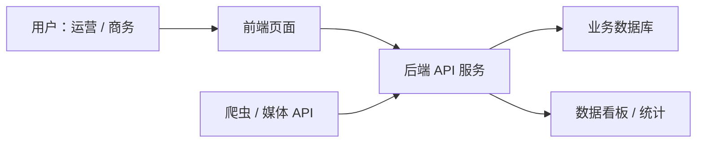
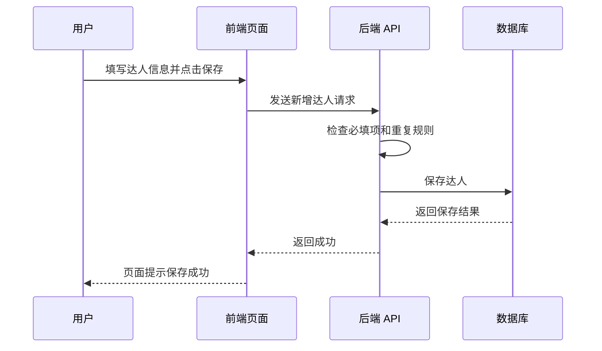
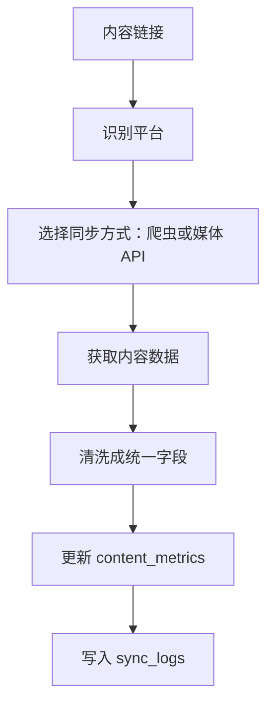

# 达人内容运营平台技术方案说明 V1.0

## 1. 这份文档解决什么问题

这份文档用尽量白话的方式说明：这个平台从技术上由哪些部分组成，每一部分负责什么，数据是怎么从页面保存到数据库里的，以及后续爬虫/API 自动回收数据应该放在哪里。

你可以先把整个平台理解成一个“带后台系统的业务工具”：

- 前端：你看到和操作的页面。
- 后端：负责业务规则、数据校验、读写数据。
- 数据库：长期保存达人、内容、项目和数据。
- 接口 API：前端和后端之间的沟通方式。
- 爬虫/API 同步模块：后续自动去媒体平台拿内容数据。

## 2. 整体架构

简单解释：

1. 运营或商务在前端页面上新增达人、录入内容、查看数据。
2. 前端把用户填写的信息通过 API 发给后端。
3. 后端检查数据是否合规，例如达人是否重复、内容链接是否重复。
4. 检查通过后，后端把数据保存到数据库。
5. 后续爬虫/API 可以自动获取播放、点赞、评论、收藏、转发，再写回数据库。
6. 页面再从数据库读取最新数据，展示列表、详情和看板。

## 3. 前端负责什么

前端就是用户看到的页面和操作体验。

在这个平台里，前端主要负责：

| 模块 | 前端要做的事 |
| --- | --- |
| 左侧导航 | 展示首页、达人库、项目库、内容库等入口 |
| 首页仪表盘 | 展示达人数量、内容数量、播放量、互动量等概览 |
| 达人列表 | 展示达人信息，支持搜索、筛选、新增、编辑、查看详情 |
| 项目列表 | 展示项目，支持新增、编辑、查看详情 |
| 内容列表 | 展示内容和数据，支持搜索、筛选、新增、编辑、查看详情 |
| 新增/编辑抽屉 | 在右侧弹出表单，让用户录入数据 |
| 详情页 | 展示单个达人、项目或内容的完整信息 |
| 数据状态展示 | 展示待同步、同步成功、同步失败等状态 |

前端不应该自己决定核心业务规则。

例如：

- 前端可以提示“达人名称不能为空”。
- 但最终是否允许保存，要由后端再检查一遍。
- 前端可以展示“内容链接已存在”的错误。
- 但真正判断是否重复，要由后端查数据库。

这样做是为了保证数据安全和规则一致。

## 4. 后端负责什么

后端可以理解为平台的“业务大脑”。

它不直接给用户看页面，但它决定：

- 数据能不能保存。
- 数据保存到哪里。
- 数据怎么查出来。
- 哪些字段必须填。
- 哪些记录不能重复。
- 后续爬虫/API 拿到的数据怎么写回平台。

在这个平台里，后端主要负责：

| 模块 | 后端要做的事 |
| --- | --- |
| 达人管理 | 新增、编辑、查询达人，检查“达人 + 媒体平台”是否重复 |
| 项目管理 | 新增、编辑、查询项目 |
| 内容管理 | 新增、编辑、查询内容，检查内容链接是否重复 |
| 数据管理 | 保存播放、点赞、评论、收藏、转发 |
| 统计汇总 | 计算首页概览数据，例如达人数、内容数、总播放量 |
| 同步任务 | 后续触发爬虫/API，更新内容数据 |
| 错误处理 | 告诉前端为什么失败，例如字段缺失、重复录入 |

## 5. 数据库负责什么

数据库是平台的“长期档案柜”。

它保存所有真正需要长期留下来的数据：

- 达人是谁。
- 达人在哪个平台。
- 达人的联系方式。
- 内容是哪条链接。
- 内容属于哪个达人。
- 内容属于哪个项目。
- 内容的播放、点赞、评论、收藏、转发是多少。
- 自动同步有没有成功。

第一版数据库表：

| 表 | 作用 |
| --- | --- |
| `influencers` | 达人表 |
| `projects` | 项目表 |
| `contents` | 内容表 |
| `content_metrics` | 内容数据表 |
| `sync_logs` | 数据同步日志表 |

学习和本地开发阶段可以用 SQLite。

正式公司内部使用时，建议换成 PostgreSQL。

## 6. API 接口负责什么

API 可以理解成前端和后端之间的“对话格式”。

前端不会直接改数据库，而是通过 API 请求后端。

例如用户新增达人：

第一版常见 API：

| API | 作用 |
| --- | --- |
| `GET /api/influencers` | 查询达人列表 |
| `POST /api/influencers` | 新增达人 |
| `GET /api/influencers/{id}` | 查询达人详情 |
| `PUT /api/influencers/{id}` | 编辑达人 |
| `GET /api/projects` | 查询项目列表 |
| `POST /api/projects` | 新增项目 |
| `GET /api/projects/{id}` | 查询项目详情 |
| `PUT /api/projects/{id}` | 编辑项目 |
| `GET /api/contents` | 查询内容列表 |
| `POST /api/contents` | 新增内容 |
| `GET /api/contents/{id}` | 查询内容详情 |
| `PUT /api/contents/{id}` | 编辑内容 |
| `PUT /api/contents/{id}/metrics` | 更新内容数据 |
| `POST /api/contents/{id}/sync` | 触发单条内容数据同步 |
| `GET /api/dashboard/summary` | 查询首页汇总数据 |

## 7. 爬虫/API 同步模块负责什么

你希望后续可以自动爬取或通过媒体 API 获取数据，这一块建议单独设计，不要和普通页面代码混在一起。

它主要负责：

- 根据内容链接识别媒体平台。
- 访问对应平台的数据来源。
- 获取播放、点赞、评论、收藏、转发。
- 把最新数据写回 `content_metrics`。
- 把同步过程写入 `sync_logs`。

自动同步流程：

注意：

- 不同平台的数据获取难度不同。
- 有的平台 API 需要官方权限。
- 有的平台爬虫可能不稳定，也可能受到平台规则限制。
- 所以第一版页面先把同步状态预留出来，真正自动化可以分阶段做。

## 8. 前后端交互举例

### 8.1 新增达人

用户动作：

- 点击“新增达人”。
- 填写达人名称、媒体平台、粉丝数、联系方式。
- 点击保存。

技术过程：

1. 前端检查基本字段是否填写。
2. 前端调用 `POST /api/influencers`。
3. 后端检查“达人名称 + 媒体平台”是否重复。
4. 不重复则写入 `influencers` 表。
5. 后端返回新增成功。
6. 前端刷新达人列表。

### 8.2 新增内容

用户动作：

- 点击“新增内容”。
- 搜索并选择达人。
- 系统自动带出媒体平台。
- 填写内容标题、内容链接、发布时间。
- 可选关联项目。
- 点击保存。

技术过程：

1. 前端调用达人搜索接口，让用户选达人。
2. 用户选择达人后，前端拿到达人 ID。
3. 前端调用 `POST /api/contents`。
4. 后端检查内容链接是否重复。
5. 后端检查达人是否存在。
6. 后端保存内容到 `contents` 表。
7. 后端给这条内容创建一条默认 `content_metrics` 数据记录。
8. 前端刷新内容列表。

### 8.3 更新内容数据

用户动作：

- 在内容详情页或列表中更新播放、点赞、评论、收藏、转发。

技术过程：

1. 前端调用 `PUT /api/contents/{id}/metrics`。
2. 后端检查内容是否存在。
3. 后端更新 `content_metrics`。
4. 前端展示最新数据。

### 8.4 自动同步内容数据

用户动作：

- 点击“同步数据”，或系统定时自动同步。

技术过程：

1. 后端把这条内容的同步状态改成“同步中”。
2. 同步模块根据内容链接识别平台。
3. 同步模块获取播放、点赞、评论、收藏、转发。
4. 成功后更新 `content_metrics`。
5. 成功或失败都写入 `sync_logs`。
6. 前端展示同步结果。

## 9. 第一版推荐技术栈

为了学习 vibe coding，同时做出真实可用的东西，建议分两个阶段。

### 9.1 学习版 / 本地 MVP

| 层 | 推荐 |
| --- | --- |
| 前端 | HTML + CSS + JavaScript |
| 后端 | Python |
| 数据库 | SQLite |
| 运行方式 | 本地电脑启动 |

优点：

- 最容易理解。
- 文件少，学习成本低。
- 可以真实实现前后端交互。
- 可以真实保存数据。

不足：

- 页面工程化能力较弱。
- 不适合多人长期正式使用。

### 9.2 正式版 / 后续升级

| 层 | 推荐 |
| --- | --- |
| 前端 | React 或 Vue |
| 后端 | Python FastAPI 或 Node.js |
| 数据库 | PostgreSQL |
| 部署 | 云服务器 / 公司内部服务器 |
| 定时任务 | 后端任务队列或定时调度 |
| 看板 | 平台内看板或 BI 工具 |

优点：

- 更适合公司内部长期使用。
- 扩展性更好。
- 更适合多人协作和权限管理。
- 更适合后续接爬虫/API/看板。

## 10. 为什么不一开始就用很复杂的架构

因为现在最重要的是先把业务闭环跑通：

- 能录入达人。
- 能录入内容。
- 能把内容和达人关联。
- 能防止重复。
- 能保存内容数据。
- 能为自动取数预留位置。

如果一开始就做完整权限、流程审批、ODS、任务队列、复杂看板，开发成本会变高，也更难学习。

更稳的路线是：

1. 先做本地 MVP，把业务闭环跑通。
2. 再升级数据库和接口结构。
3. 再做爬虫/API 自动同步。
4. 再做数据看板和权限体系。

## 11. 后续开发顺序建议

建议按这个顺序进入开发：

| 顺序 | 内容 | 目标 |
| --- | --- | --- |
| 1 | 建数据库表 | 先有地方存数据 |
| 2 | 写后端 API | 让数据可以新增、查询、编辑 |
| 3 | 写前端基础页面 | 让用户可以操作 |
| 4 | 打通达人新增和列表 | 完成第一个真实闭环 |
| 5 | 打通项目新增和列表 | 完成项目库 |
| 6 | 打通内容新增和列表 | 完成内容和达人关联 |
| 7 | 打通内容数据录入 | 完成数据回收 |
| 8 | 做详情页 | 让信息可追溯 |
| 9 | 做首页汇总 | 形成运营视角 |
| 10 | 预留同步入口 | 为爬虫/API 做准备 |

## 12. 第一版技术结论

第一版平台可以采用：

- 前端：负责页面展示和用户操作。
- 后端：负责业务规则、数据校验、接口服务。
- 数据库：负责长期保存达人、项目、内容和数据。
- API：负责前端和后端沟通。
- 同步模块：后续负责爬虫/API 自动获取数据。

学习阶段建议先用简单技术栈做出真实可用的 MVP。这样你能清楚理解每一层在干什么，也能一步步把平台从“在线表格升级版”做成真正的达人运营中台。
