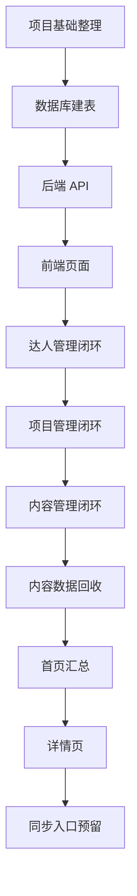

# 达人内容运营平台开发任务拆解 V1.0

## 1. 这份文档解决什么问题

这份文档把平台开发拆成一小步一小步，避免一上来就面对一大堆代码。

后面我们会按这个顺序推进：

1. 先做一个最小可用闭环。
2. 每完成一步，就验证一次。
3. 每写一块代码，都解释它在系统里负责什么。
4. 不追求一步到位，先让平台真实能用。

## 2. 开发总路线

## 3. 第一阶段：项目基础整理

目标：让项目结构清楚，后面写代码不乱。

| 任务 | 做什么 | 完成标准 | 你需要理解 |
| --- | --- | --- | --- |
| 1.1 | 整理项目目录 | 知道前端、后端、数据库、文档分别放在哪里 | 文件夹就像办公区，不同资料放不同地方 |
| 1.2 | 明确运行方式 | 可以在本地启动平台 | 本地启动就是在你电脑上跑一个小服务 |
| 1.3 | 明确数据文件位置 | 知道数据保存在哪里 | SQLite 会生成一个数据库文件 |

建议目录：

| 目录/文件 | 作用 |
| --- | --- |
| `server.py` | 后端服务 |
| `public/` | 前端页面文件 |
| `data/` | 本地数据库文件 |
| `docs/` | 产品、设计、技术文档 |
| `README.md` | 项目说明 |

## 4. 第二阶段：数据库建表

目标：先有地方保存数据。

| 任务 | 做什么 | 完成标准 | 你需要理解 |
| --- | --- | --- | --- |
| 2.1 | 建达人表 | 可以保存达人基础信息 | 表就是更严格的在线表格 |
| 2.2 | 建项目表 | 可以保存合作项目 | 项目是单独的资料库 |
| 2.3 | 建内容表 | 可以保存发布后的内容链接 | 内容必须关联达人 |
| 2.4 | 建内容数据表 | 可以保存播放、点赞、评论、收藏、转发 | 数据和内容分开存，更方便扩展 |
| 2.5 | 建同步日志表 | 可以记录后续自动同步结果 | 为爬虫/API 做准备 |

完成后要验证：

- 数据库文件能生成。
- 表都存在。
- 达人重复规则能生效。
- 内容链接重复规则能生效。

## 5. 第三阶段：后端 API

目标：让前端可以通过接口读写数据。

### 5.1 达人 API

| 接口 | 作用 | 完成标准 |
| --- | --- | --- |
| `GET /api/influencers` | 查询达人列表 | 页面能拿到达人列表 |
| `POST /api/influencers` | 新增达人 | 能保存新达人 |
| `GET /api/influencers/{id}` | 查询达人详情 | 能看到单个达人完整信息 |
| `PUT /api/influencers/{id}` | 编辑达人 | 能修改达人信息 |

验证重点：

- 不允许达人名称为空。
- 不允许媒体平台为空。
- 不允许同一个“达人 + 媒体平台”重复。

### 5.2 项目 API

| 接口 | 作用 | 完成标准 |
| --- | --- | --- |
| `GET /api/projects` | 查询项目列表 | 页面能拿到项目列表 |
| `POST /api/projects` | 新增项目 | 能保存新项目 |
| `GET /api/projects/{id}` | 查询项目详情 | 能看到单个项目完整信息 |
| `PUT /api/projects/{id}` | 编辑项目 | 能修改项目信息 |

验证重点：

- 项目名称必填。
- 项目可以被内容关联。
- 项目不是内容录入的必填项。

### 5.3 内容 API

| 接口 | 作用 | 完成标准 |
| --- | --- | --- |
| `GET /api/contents` | 查询内容列表 | 页面能拿到内容列表 |
| `POST /api/contents` | 新增内容 | 能保存新内容 |
| `GET /api/contents/{id}` | 查询内容详情 | 能看到单条内容完整信息 |
| `PUT /api/contents/{id}` | 编辑内容 | 能修改内容信息 |

验证重点：

- 内容标题必填。
- 内容链接必填。
- 发布时间必填。
- 内容必须关联一个达人。
- 内容链接不能重复。

### 5.4 内容数据 API

| 接口 | 作用 | 完成标准 |
| --- | --- | --- |
| `PUT /api/contents/{id}/metrics` | 更新内容数据 | 能保存播放、点赞、评论、收藏、转发 |
| `POST /api/contents/{id}/sync` | 触发同步 | 第一版可以先返回“已进入同步队列/暂未接入” |

验证重点：

- 播放、点赞、评论、收藏、转发应该是数字。
- 更新数据后列表和详情页能看到最新值。
- 同步入口先预留，不一定马上接真实爬虫。

### 5.5 首页汇总 API

| 接口 | 作用 | 完成标准 |
| --- | --- | --- |
| `GET /api/dashboard/summary` | 查询首页汇总 | 能返回达人数量、内容数量、总播放量、总互动量 |

验证重点：

- 新增内容或更新数据后，首页汇总会变化。

## 6. 第四阶段：前端页面

目标：让用户可以通过页面完成操作。

| 页面 | 做什么 | 完成标准 |
| --- | --- | --- |
| 首页 | 展示核心数据概览 | 能看到达人数量、内容数量、播放量、互动量 |
| 达人列表页 | 管理达人 | 能搜索、筛选、新增、编辑、进入详情 |
| 达人详情页 | 查看达人完整信息 | 能看到达人资料和关联内容 |
| 项目列表页 | 管理项目 | 能新增、编辑、查看项目 |
| 项目详情页 | 查看项目完整信息 | 能看到项目资料和关联内容 |
| 内容列表页 | 管理已发布内容 | 能新增内容、关联达人、查看数据 |
| 内容详情页 | 查看内容完整信息 | 能看到内容信息和数据表现 |

第一版页面方式：

- 左侧固定导航。
- 列表页用表格。
- 新增/编辑用右侧抽屉。
- 详情用独立详情页。
- 搜索筛选放在列表顶部。

## 7. 第五阶段：达人管理闭环

目标：先完成第一个最小闭环。

这个闭环包括：

1. 打开达人列表。
2. 点击新增达人。
3. 填写达人名称、媒体平台、粉丝数、联系方式。
4. 点击保存。
5. 后端保存到数据库。
6. 列表刷新后看到刚新增的达人。
7. 尝试重复新增同平台同名达人，系统提示重复。

完成标准：

- 能新增达人。
- 能编辑达人。
- 能搜索达人。
- 能防止重复达人。
- 能查看达人详情。

这是最适合你学习的第一个闭环，因为它最像“把在线表格变成系统”。

## 8. 第六阶段：项目管理闭环

目标：完成项目库。

这个闭环包括：

1. 打开项目列表。
2. 新增项目。
3. 编辑项目。
4. 查看项目详情。
5. 后续内容可以选择关联项目。

完成标准：

- 能新增项目。
- 能编辑项目。
- 能查看项目详情。
- 内容录入时可以选择项目，但不是必填。

## 9. 第七阶段：内容管理闭环

目标：完成平台最核心的“达人 + 内容”关联。

这个闭环包括：

1. 打开内容列表。
2. 点击新增内容。
3. 搜索并选择达人。
4. 自动带出媒体平台。
5. 填写内容标题、内容链接、发布时间。
6. 可选选择项目。
7. 点击保存。
8. 后端保存内容，并关联达人。
9. 列表展示内容、达人、平台、项目。

完成标准：

- 内容必须选择达人。
- 内容链接必填且不能重复。
- 内容可以关联项目，也可以不关联。
- 达人详情里能看到该达人发布过的内容。
- 项目详情里能看到该项目关联的内容。

## 10. 第八阶段：内容数据回收

目标：让每条内容可以保存数据表现。

需要支持的字段：

- 播放量
- 点赞
- 评论
- 收藏
- 转发

第一版方式：

- 支持手动录入和修改。
- 页面展示同步状态。
- 为后续自动同步预留入口。

完成标准：

- 能更新一条内容的数据。
- 内容列表能展示数据。
- 内容详情能展示数据。
- 首页汇总能统计数据。

## 11. 第九阶段：首页汇总

目标：让运营一进来就能看到整体情况。

第一版首页指标：

| 指标 | 说明 |
| --- | --- |
| 达人总数 | 当前系统内达人数量 |
| 内容总数 | 当前系统内内容数量 |
| 总播放量 | 所有内容播放量之和 |
| 总互动量 | 点赞 + 评论 + 收藏 + 转发 |
| 近期发布内容 | 最近录入或最近发布的内容 |
| 同步失败内容 | 后续自动同步失败时展示 |

完成标准：

- 首页能显示统计卡片。
- 新增内容或更新数据后，统计结果会变化。

## 12. 第十阶段：详情页

目标：让数据可追溯，不只是看列表。

| 详情页 | 要展示什么 |
| --- | --- |
| 达人详情 | 达人基础信息、联系方式、关联内容 |
| 项目详情 | 项目信息、项目下的内容 |
| 内容详情 | 内容基础信息、关联达人、关联项目、内容数据 |

完成标准：

- 从列表点击可以进入详情页。
- 详情页能返回列表。
- 详情页展示的信息比列表更完整。

## 13. 第十一阶段：同步入口预留

目标：先把自动取数的位置留好，后续再接真实爬虫/API。

第一版先做：

- 内容数据表里有同步状态。
- 内容列表展示同步状态。
- 内容详情有“同步数据”按钮。
- 点击后可以先提示“同步能力开发中”或模拟同步结果。
- 后端保留 `POST /api/contents/{id}/sync` 接口。

后续再做：

- 识别内容平台。
- 接入媒体 API。
- 或开发爬虫。
- 自动更新内容数据。
- 写入同步日志。

完成标准：

- 页面上已经有同步入口。
- 数据库里已经有同步状态。
- 后端接口已经预留。
- 后续接真实同步时，不需要大改页面结构。

## 14. 每一步怎么验收

每完成一个小功能，都按下面方式验收：

| 验收问题 | 说明 |
| --- | --- |
| 页面能不能打开 | 先确认没有白屏或报错 |
| 数据能不能保存 | 保存后刷新页面，数据还在 |
| 重复规则能不能生效 | 重复达人、重复内容链接要拦住 |
| 关联关系对不对 | 内容能不能正确关联达人和项目 |
| 修改后是否生效 | 编辑后列表和详情是否更新 |
| 错误提示是否清楚 | 用户知道为什么保存失败 |

## 15. 适合你的学习方式

后面进入代码时，建议每次只学习一个小闭环：

| 学习顺序 | 你会理解什么 |
| --- | --- |
| 新增达人 | 页面表单如何把数据发给后端 |
| 达人列表 | 后端如何从数据库查数据给页面 |
| 防重复 | 数据库和后端如何共同保证规则 |
| 新增内容 | 一条内容如何关联一个达人 |
| 内容数据 | 数据如何更新和统计 |
| 首页汇总 | 多条数据如何变成运营指标 |
| 同步入口 | 后续自动爬虫/API 如何接入 |

你不需要一开始看懂所有代码。我们会用“这个文件负责什么、这一段实现什么业务动作”的方式拆开讲。

## 16. 第一版开发结论

第一版开发目标不是做一个特别庞大的系统，而是完成一个真实可用的运营平台 MVP：

- 能管理达人。
- 能管理项目。
- 能录入已发布内容。
- 能把内容关联到达人。
- 能保存内容数据。
- 能做基础汇总。
- 能为后续自动同步预留位置。

建议从“达人管理闭环”开始开发，因为它最简单，也最能帮助你理解前端、后端、数据库是怎么配合的。
